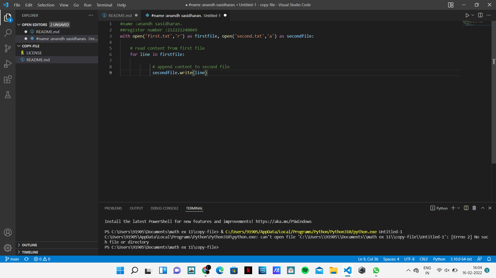
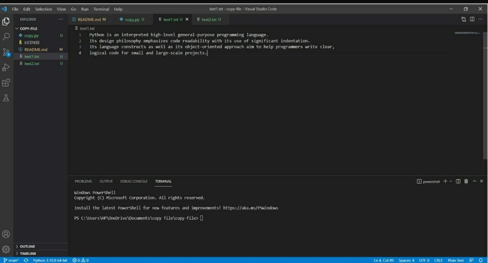
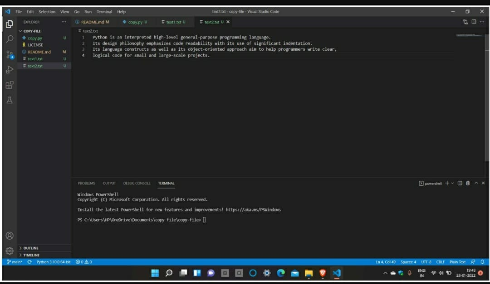

# copy-file
## AIM:
To write a python program for copying the contents from one file to another file.
## EQUIPEMENT'S REQUIRED: 
PC
Anaconda - Python 3.7
## ALGORITHM: 
## Step 1:
Start

## Step 2:
Open the first file in read mode by an appropriate method.

## Step 3:
Open the second file in write mode by an appropriate method.

## Step 4:
Loop until a variable 'i' in the first file . So variable i propagates all over the content.

## Step 5:
Write the value of 'i' in the second file by following method.

## Step 6:
stop
## PROGRAM:
~~~
name :anandh sasidharan.
register number :212221240049

with open('first.txt','r') as firstfile, open('second.txt','a') as secondfile:
      
    # read content from first file
    for line in firstfile:
               
             # append content to second file
             secondfile.write(line)
~~~
### OUTPUT:

## RESULT:
Thus the program is written to copy the contents from one file to another file.
